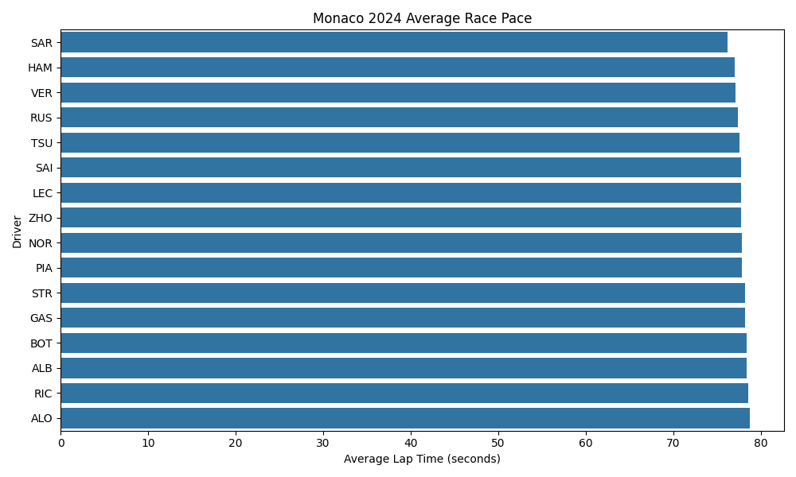
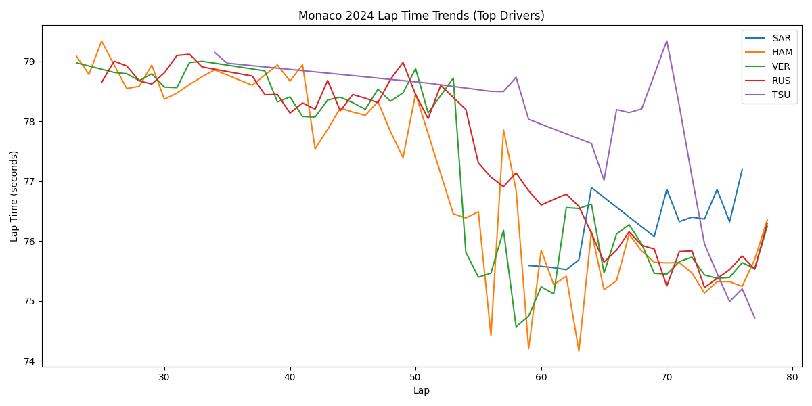
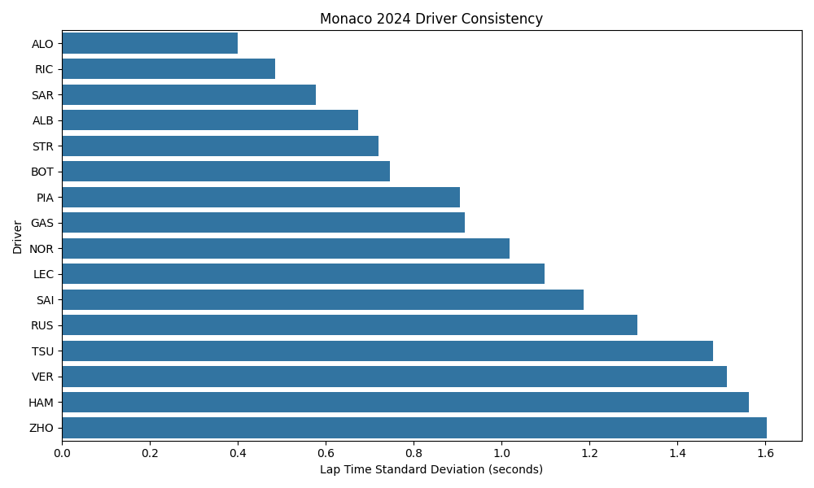
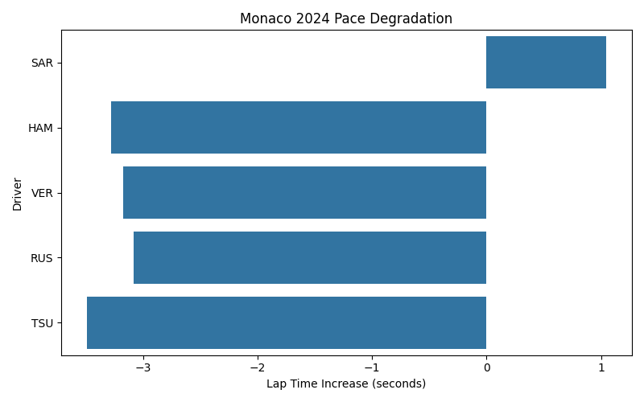

<p align="center">
  
</p>

# F1 Race Insights

**A motorsport analytics lab exploring race performance, strategy, and driver behavior through data.**

F1 Race Insights is a small motorsport analytics lab focused on turning race-session data into fast, visual performance studies.

It is intentionally lean: one script, a clear output set, and a bias toward insight over ceremony.

## What This Is

This repository explores Formula 1 race data through a compact analysis workflow built with FastF1, pandas, matplotlib, and seaborn.

The current implementation pulls a race session, filters to representative quick laps, calculates a handful of pace metrics, and exports charts that make the race easier to read at a glance.

This is not positioned as a production application. It is a lab environment: a place to test motorsport questions, compare drivers, and develop visual analysis patterns that can evolve into richer tooling later.

## Why It's Interesting

Motorsport data sits at the intersection of engineering, strategy, and storytelling.

Even a small slice of race timing data can reveal:

- who truly had underlying pace
- who managed consistency best
- which front-runners faded across the run
- how race shape appears when reduced to visual patterns instead of raw tables

That combination makes Formula 1 a strong playground for analytics work: the domain is technical, the patterns are visible, and the output is immediately interpretable.

## Data Sources

This project currently uses:

- FastF1 for race session timing and lap data
- FastF1's local cache for repeatable, faster reruns

The active example in `main.py` analyzes the 2024 Monaco Grand Prix race session.

For a more detailed walkthrough of the process, see [docs/methodology.md](/C:/dev/f1-race-insights/docs/methodology.md).

## Example Analysis

The current output set focuses on four views of the same race:

### Average Driver Pace



### Lap Time Trends



### Driver Consistency



### Pace Degradation



## What This Shows

Taken together, these charts provide a compact reading of race performance:

- average pace shows the broad competitive order
- lap trends show how leading drivers behaved over time
- consistency highlights smooth versus noisy race execution
- degradation gives a quick signal for end-of-run fade

The result is less about one headline number and more about building a layered picture of how a race unfolded.

## Run Locally

Install the existing dependencies and run the script:

```bash
pip install -r requirements.txt
python main.py
```

Outputs are written to:

- `charts/`
- `cache/`

## Future Direction

This repo is a foundation for broader motorsport analysis work. Natural next steps include:

- multi-race comparisons across circuits and seasons
- stint-aware pace modeling
- tire-compound overlays
- safety-car and traffic segmentation
- richer telemetry-derived views
- driver-versus-teammate benchmarking

The lab is small on purpose, but the direction is expansive.

## Philosophy

Good analytics projects do not need to be bloated to be serious.

This repository favors a different posture:

- start with clean questions
- use minimal tooling
- produce charts that carry real explanatory weight
- leave room for iteration instead of pretending the first pass is the final system

F1 Race Insights is designed to feel like an active research bench for motorsport performance, not just a script that happens to save a few PNGs.

---

Crouch Development  
Systems. Strategy. Execution.

This repository is part of an ongoing set of technical experiments and architecture explorations conducted under the Crouch Development umbrella.

https://crouchdevelopment.com
